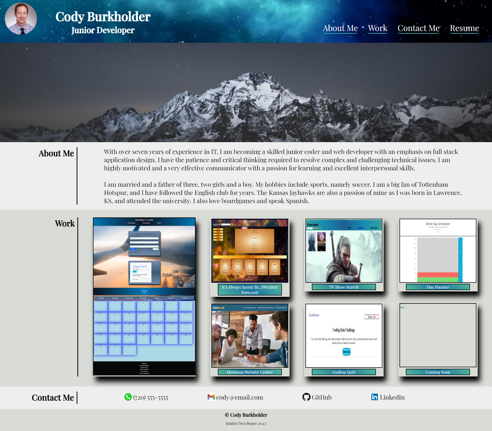

# Professional Portfolio Application

## Description

A professional porfolio application was requested to provide examples of my work as a junior developer.  The application includes a section with contact information, information about me, and images with embedded links to my deployed applications.  The application is responsive and allows for improved viewing experiences on smaller screens.  A "Website in progress.  Thank you for your patience." message is still included on the site as I plan to udpate and maintain the site as my development work continues.

## Website URL

https://chilejay7.github.io/Professional-Portfolio/

## Usage

A screenshot of the webiste design is included below for reference.

## Credits

The hamburger menu was built using code from the tutorial linked below.  Addtional changes and styling were made to the starter code to allow it to better fit the needs of my application.

https://dev.to/ljcdev/easy-hamburger-menu-with-js-2do0

## License

Please refer to the LICENSE in the repo.